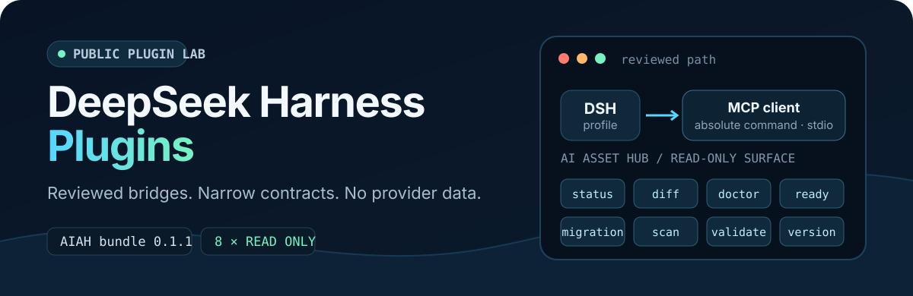

<p align="center">
  
</p>

<p align="center">
  
  
  <a href="./LICENSE"></a>
  
</p>

Expose AI Asset Hub's reviewed, read-only MCP tools inside DeepSeek Harness
without bundling provider code, data, credentials, or machine-specific paths.
The first package in this public monorepo is a small configuration bundle with
a deliberately narrow contract.

> [!IMPORTANT]
> `@dff652/dsh-ai-asset-hub@0.1.1` is a local clean-history candidate. It is
> not yet pushed, public, tagged, released, published to npm, listed in a
> marketplace, or deployed to a live profile.

## What you get

| | Contract |
| --- | --- |
| **One provider bridge** | Starts a deployment-owned `aiah mcp` process through the official DSH MCP client. |
| **Eight read-only tools** | Status, diff, doctor, migration readiness/status, scan, validate, and version. |
| **Fail-closed activation** | Rejects missing, blank, or relative `DSH_AIAH_COMMAND` values. |
| **Five-file package** | Ships only `package.json`, `index.js`, `cordis.patch.yml`, `README.md`, and `LICENSE`. |

The bundle does **not** ship the AI Asset Hub executable, copy provider
handlers, store credentials, or expose build/apply/rollback operations.

## Validate the local candidate

Pack from a reviewed checkout, record the resulting digest, and install only
that exact tarball into a disposable DSH profile:

```bash
npm pack --workspace @dff652/dsh-ai-asset-hub --ignore-scripts
sha256sum dff652-dsh-ai-asset-hub-0.1.1.tgz
dsh plugin --profile <profile> add ./dff652-dsh-ai-asset-hub-0.1.1.tgz
dsh --profile <profile> --dump-config
```

The deployment must set `DSH_AIAH_COMMAND` to the absolute path of its
separately reviewed `aiah` executable. The bundle passes exactly one argument,
`mcp`, and never resolves the executable through `PATH`.

## How the boundary works

```text
DeepSeek Harness profile
        │
        ├─ @dff652/dsh-ai-asset-hub      configuration only
        │          │
        │          └─ @deepseek-ai/dsh-mcp-client@0.1.0-rc.6
        │                         │ stdio
        │                         ▼
        └────────────── DSH_AIAH_COMMAND mcp
                                  │
                                  └─ 8 reviewed read-only tools
```

Provider binaries, identities, homes, endpoints, credentials, and runtime data
remain outside the package. MCP annotations are descriptive metadata rather
than a permission system, so provider-side zero-write tests remain the
authority for the read-only invariant.

## Model-visible tool contract

```text
mcp__aiah__aiah_asset_status
mcp__aiah__aiah_diff
mcp__aiah__aiah_doctor
mcp__aiah__aiah_migration_readiness
mcp__aiah__aiah_migration_status
mcp__aiah__aiah_scan
mcp__aiah__aiah_validate
mcp__aiah__aiah_version
```

The namespace is frozen by contract tests. Writer tools such as build, apply,
and rollback are intentionally absent.

## Verify from source

Run the portable repository and package checks:

```bash
npm run check:repo
npm test
npm pack --workspace @dff652/dsh-ai-asset-hub --dry-run --ignore-scripts
```

On a host with the reviewed DSH runtime, run the activation and process
lifecycle gates. These fail instead of silently skipping when `dsh` is absent:

```bash
npm run test:activation:aiah
npm run test:lifecycle:aiah
```

For provider E2E acceptance, point the verifier at a separately reviewed AIAH
executable and disposable test data—never a personal provider home or live
profile:

```bash
npm run verify:aiah -- \
  --command /absolute/path/to/aiah \
  --testdata-root /absolute/path/to/disposable/aiah-testdata
```

The verifier checks initialization, the exact eight-tool surface, a version
canary, safe calls, and optional zero-write snapshots.

## Reviewed compatibility

| Component | Reviewed value |
| --- | --- |
| Package | `@dff652/dsh-ai-asset-hub@0.1.1` candidate |
| DeepSeek Harness | `0.1.0-rc.6` |
| MCP client | `@deepseek-ai/dsh-mcp-client@0.1.0-rc.6` |
| Node.js | `^22.19.0 \|\| >=24.0.0` |
| AI Asset Hub executable | Official Release `v0.1.11` |

CI runs the portable contract on Node 22.19 and 24.19. The recorded runtime
acceptance used Node 24.19, a disposable DSH home, disposable test data, and the
official AIAH `v0.1.11` Linux AMD64 asset.

## Release state

| Transition | State |
| --- | --- |
| Clean local repository | In progress; no remote |
| Public repository and `dsh-plugin` topic | Not created |
| Reviewed GitHub Release tarball | Not released |
| npm publication | Not published |
| Marketplace listing | Not submitted |
| Model-visible L5 acceptance | Not claimed |
| Live-profile deployment | Not part of this repository |

Read the full [release-readiness record](./docs/release-readiness.md) for exact
digests, environment evidence, remaining gates, and the rule that publication
and deployment transitions require separate authorization.

## Project notes

- This is an independent project, not an official DeepSeek project or an
  official security review of AI Asset Hub.
- Future providers must enter as separate workspaces after their own source,
  license, secret, artifact, and disposable-profile review.
- Agent Mail is future scope; no placeholder bundle or automatic-wake claim is
  included here.

Contributions are welcome within the documented public boundary. Start with
[CONTRIBUTING.md](./CONTRIBUTING.md), and report vulnerabilities according to
[SECURITY.md](./SECURITY.md).

## License

[MIT](./LICENSE)
